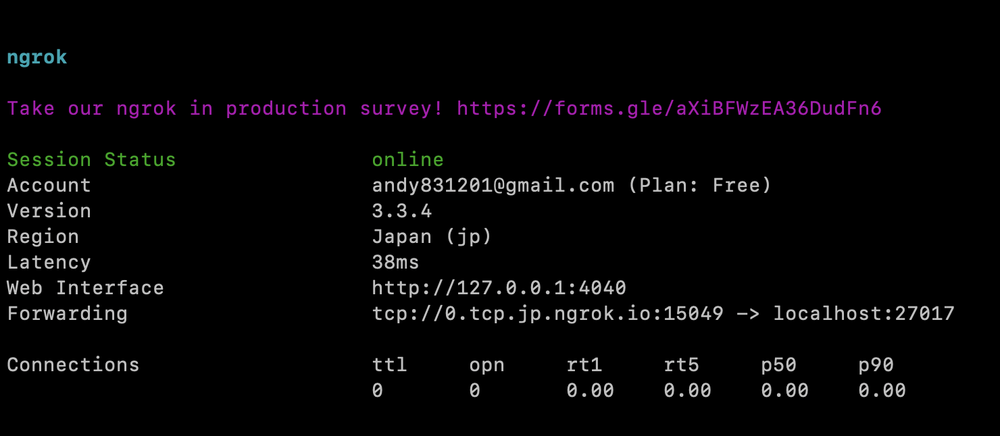
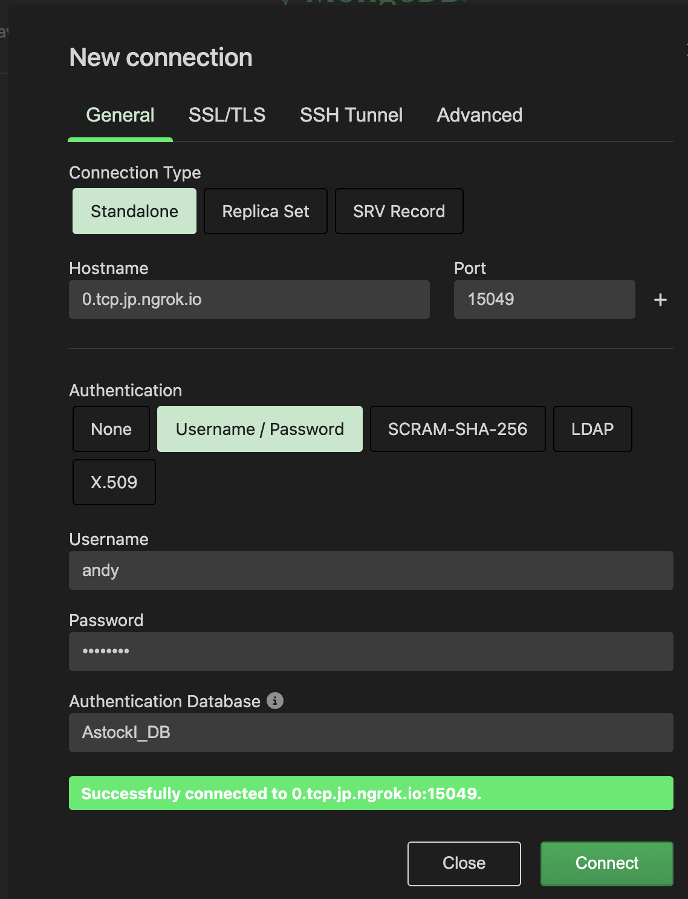

# MongoDB
## 安裝相關服務:
下載 mongo 映像檔(image)
```sh
docker pull mongo
```
下載ngrok服務
```sh
sudo apt install ngrok
```
設定ngrok服務
```sh
# 設定token，token由ngrok網站取得
ngrok config add-authtoken *******
```
## 啟動、設定MongoDB:
啟動mongo container
```sh
docker run --name mongo \
-v /data/mongoDB_data:/data/db \ # mount db資料
-p 27017:27017 \
--rm -d \
mongo --auth    # 需輸入帳號密碼
```
進入mongo container進行設定
```sh
docker exec -it mongo bash
```
容器內執行mongo設定程式
```sh
root@in_mongo_container:/ mongosh
```
進入mongo設定程式
```py
use AstockI_DB  # 切換至AstockI_DB 資料庫

db.createUser( 
    { 
        user: 'admin', 
        pwd: 'p*******', 
        roles: [{ role: 'root', db: 'admin' }] 
    } 
)   #   建立使用者，並設定權限

db.createUser(
   {
     user: "andy",
     pwd: '******',
     roles: [ "readWrite", "dbAdmin" ]
   }
)   #   建立使用者，並設定權限
```
退出容器，並啟動ngrok轉址服務
```sh
ngrok tcp 27017     # 建立mongo請使用tcp；網頁使用http
```
ngrok啟動結果如下:


mongo連線方式如下:

### 已知問題
    1. ngrok每次重啟都會更換網址，需有辦法溝通新的連線網址
### 資源
    1. ngrok 免費DNS服務
    2. mongoDB container